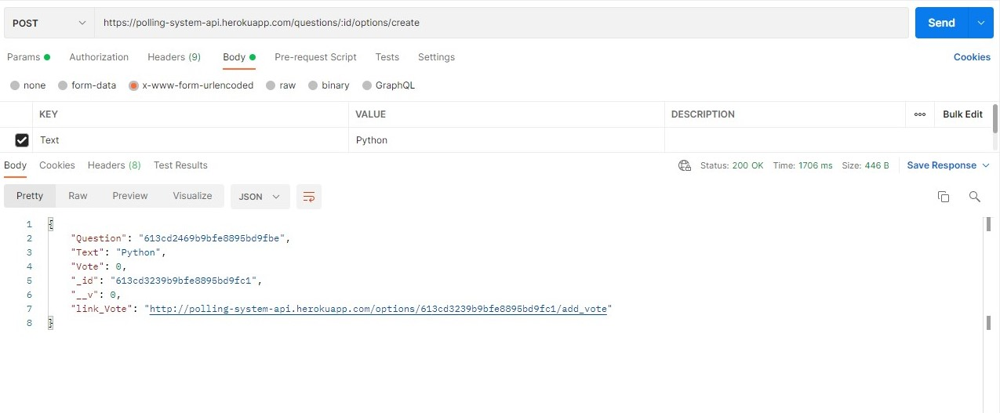
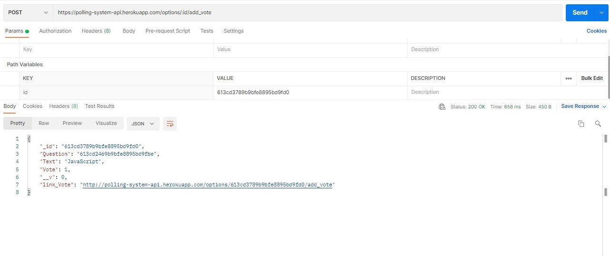
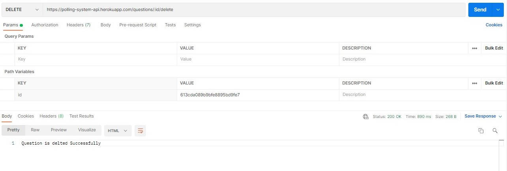
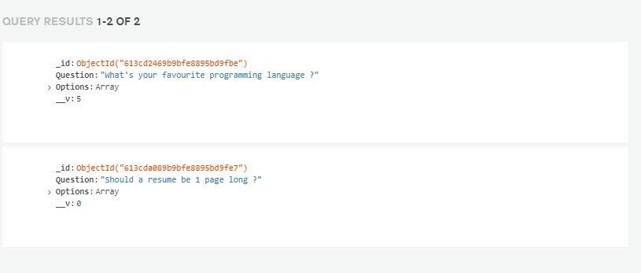
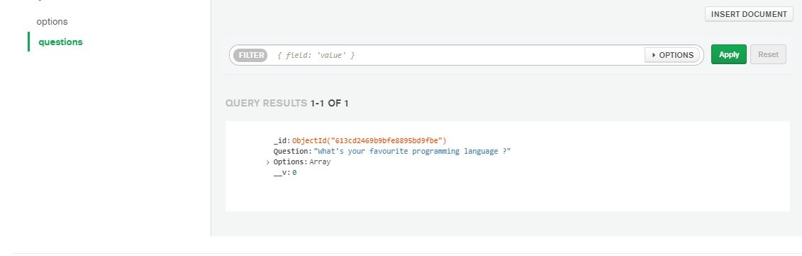
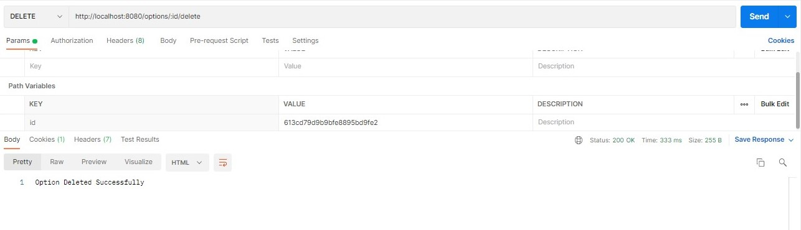
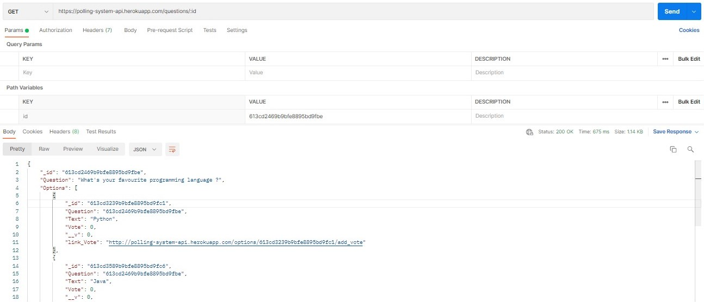
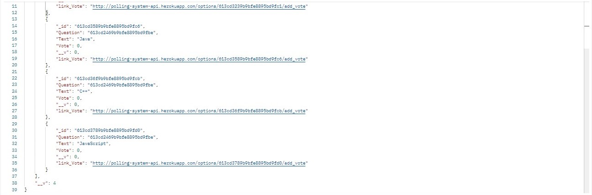

# Polling-System-API

### API :  https://polling-system-api.herokuapp.com/

### Introduction
  > It's an API where anyone can create questions with options and also add votes to it.  
  > Authentication is not needed.  

###  How to setup the project on local system

  1.  Clone this project
  2.  Start by installing npm if you don't have it already.
  3.  Navigate to Project Directory by :
  ~~~
  cd Polling-System-API
  ~~~
  4.  run following commands:
  ~~~
  npm install
  nodemon index.js
  ~~~

### Features
  * Create a Question (You can add as many questions as you want)
    * Required Routes `/questions/create`
    
  * Add options to a question
    * Required Routes `/questions/:id/options/create`
    
  * Add a vote to an option of question
    * Required Routes `/options/:id/add_vote`
    
  * Delete a question →  A question can’t be deleted if one of it’s options has votes
    * Required Routes `/questions/:id/delete `
    
    * DadaBase before delete a question
    
    * DadaBase after delete a question
    
  * Delete an option → An option can’t be deleted if it has even one vote given to it
    * Required Routes `/options/:id/delete`
    
  * View a question with it’s options and all the votes given to it
    * Required Routes `/questions/:id `
    
    

### Directory Structure
  `/config` - MongooDB Atlas Configuration  
  `/controllers`  - questions & option controllers code  
  `/model`  - question & option schemas  
  `/routes` - question & option routes  
  `index.js`  - entry file  
  
